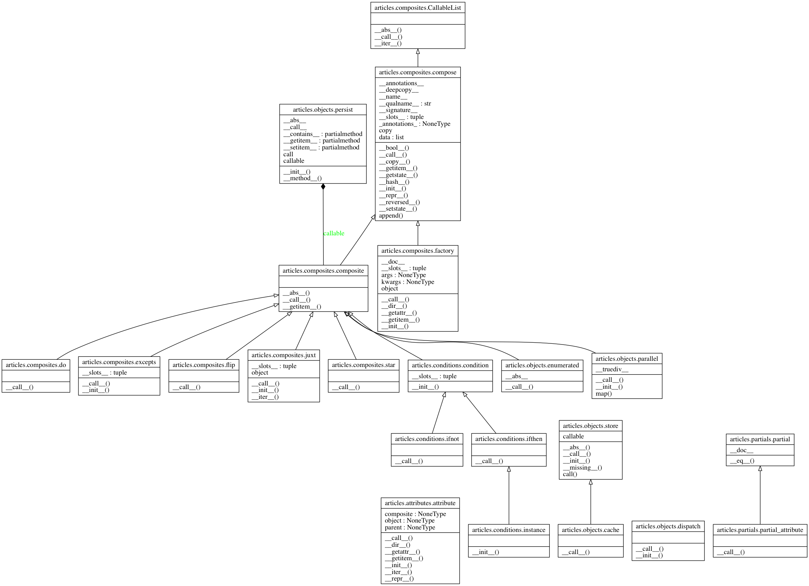

# `articles` compose functions

`articles` are cracked out Python lists that are `callable`. 

> Inspired by toolz and underscore.chain.


```python
    from articles import *    
    assert a == an == the == λ
```

## Usage

### itemgetter

Use the `getitem` method to append functions togethers.


```python
    the[range][list](10)
```


    [0, 1, 2, 3, 4, 5, 6, 7, 8, 9]


### attrgetter

Use the `getattr` method to append `the._attributes` objects togethers.


```python
    the.range().list()(10)
```


    [0, 1, 2, 3, 4, 5, 6, 7, 8, 9]


### partial


```python
    the(3).range().list()(10), the.range(3).list()(10)
```


    ([0, 1, 2, 3, 4, 5, 6, 7, 8, 9], [3, 4, 5, 6, 7, 8, 9])


### operators

`articles` include the full python data model including incremental and right operators.


```python
    for i in ['__add__', '__sub__', '__mul__', '__truediv__', '__floordiv__', '__matmul__', '__mod__']:
        print(i, getattr(a, i))
```

    __add__ <bound method factory.__getitem__ of factory>[λ>[]]>
    __sub__ <bound method factory.__getitem__ of factory>[λ>[]]>
    __mul__ <bound method factory.__getitem__ of factory>[λ>[]]>
    __truediv__ functools.partial(<bound method op_attr of factory>[λ>[]]>, '__truediv__')
    __floordiv__ functools.partial(<bound method op_attr of factory>[λ>[]]>, '__floordiv__')
    __matmul__ functools.partial(<bound method op_attr of factory>[λ>[]]>, '__matmul__')
    __mod__ functools.partial(<bound method op_attr of factory>[λ>[]]>, '__mod__')


### classes


```python
    (a**str&str.upper)(10.)
```


    False


```python
    f = a**int*range | a**str*str.upper
    f(10), f('abc')#, f(10.)
    f
```


    composite>[ifnot>instance>partial(<function flip at 0x102edebf8>, (<class 'int'>,)):[<class 'range'>]:[instance>partial(<function flip at 0x102edebf8>, (<class 'str'>,)):[<method 'upper' of 'str' objects>]]]


```python
    from pandas import *

    df = (
        the.Path('/Users/tonyfast/gists/').rglob('*.ipynb')
        .map(the[a.identity(), a.read_text().loads()^Exception])
        .filter(the.second()).take(10).dict()
        .valmap(a.get('cells', default=[]) * DataFrame)
    )[concat]()

    (the * globals * dict.items @ the.second().type() * a.valmap(len))()
```


    {_frozen_importlib_external.SourceFileLoader: 1,
     function: 9,
     dict: 1,
     _frozen_importlib.ModuleSpec: 1,
     abc.ABCMeta: 18,
     builtin_function_or_method: 4,
     tuple: 1,
     articles.factory: 4,
     str: 5,
     type: 10,
     NoneType: 1,
     toolz.functoolz.curry: 2}


## Development

Convert the single Jupyter notebook to a python script.

## `articles` structure




```bash
    %%bash 
    jupyter nbconvert --to python --TemplateExporter.exclude_input_prompt=True articles.ipynb
```

    [NbConvertApp] Converting notebook articles.ipynb to python
    [NbConvertApp] Writing 12497 bytes to articles.py


```python
    !jupyter nbconvert --to markdown readme.ipynb
    !pyreverse -o png -bmy -fALL articles
```

    [NbConvertApp] Converting notebook readme.ipynb to markdown
    [NbConvertApp] Writing 3238 bytes to readme.md
    parsing /Users/tonyfast/fidget/determiners.py...

